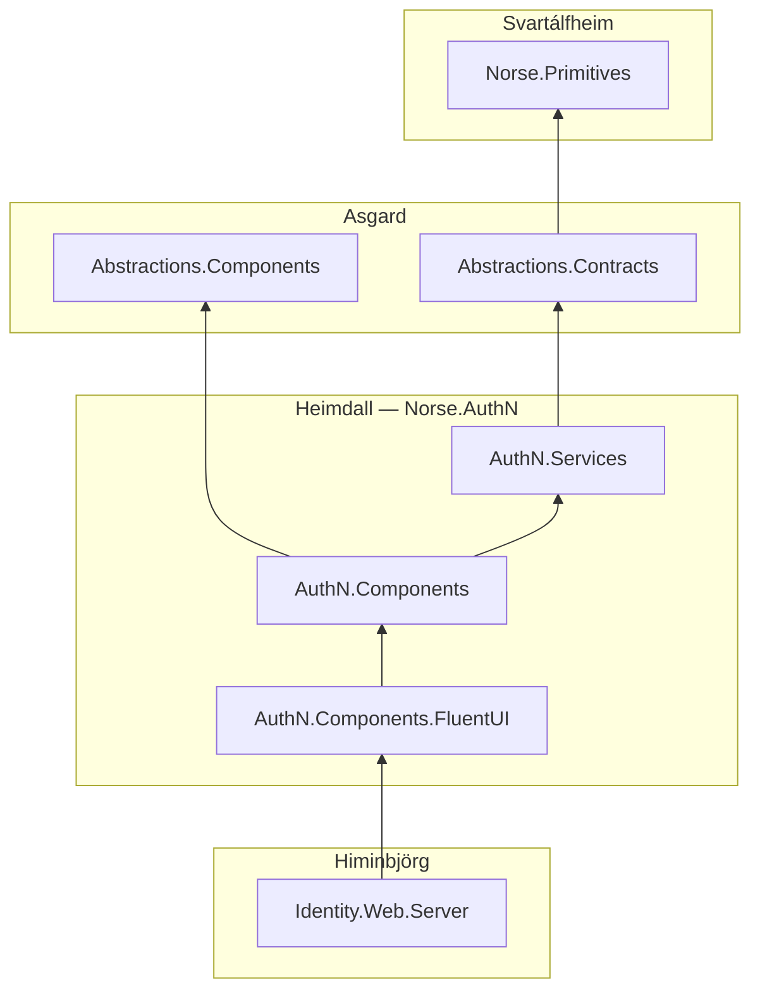

# Heimdall

> Heimdall — the watchman who decides who crosses Bifröst.

<p align="center">
  
</p>

*Image credit: [@norsemythologyclips](https://www.instagram.com/norsemythologyclips/) — go follow them.*

The authn story for the Norse Architecture — **`Norse.AuthN`**: login, register, two-factor, recovery, and personal-data disclosure, enforced identically across Blazor Server, WASM, and MAUI, with the backing gRPC contracts. Heimdall rides on nothing above [Asgard](https://github.com/NorseArchitecture/Asgard); [Himinbjörg](https://github.com/NorseArchitecture/Himinbjorg) rides on *it* — implementing the contracts and hosting the pages — so the gate and the hall that stands behind it depend on each other by design.

## What stands at the gate

| Project | What it is |
|---|---|
| [`Norse.AuthN.Services`](src/AuthN.Services) | The wire tier, deliberately thin: [`IAuthenticationService`](src/AuthN.Services/IAuthenticationService.cs) (Login / Register / EmailExists / Logout) and [`IIdentityService`](src/AuthN.Services/IIdentityService.cs) (self-disclosure and masked disclosure), their pure `[DataContract]` request records, and the policy name constants ([`AuthNPolicies`](src/AuthN.Services/AuthNPolicies.cs), [`IdentityPolicies`](src/AuthN.Services/IdentityPolicies.cs)). No result record lives here — every operation returns Asgard's `Outcome<NavigationResult>` or `Outcome<BoolResponse>`. No Razor, no validation library, no mediator coupling — a consumer building their own UI references this assembly and nothing else |
| [`Norse.AuthN.Components`](src/AuthN.Components) | The headless tier: pages with no visual framework ([Logout](src/AuthN.Components/Logout.razor), [Lockout](src/AuthN.Components/Pages/Lockout.razor), [AccessDenied](src/AuthN.Components/Pages/AccessDenied.razor), the confirmation pages), the FluentValidation validators ([login](src/AuthN.Components/LoginRequestValidator.cs), [register](src/AuthN.Components/RegisterRequestValidator.cs), [masked disclosure](src/AuthN.Components/GetMaskedPersonalDataRequestValidator.cs)), [`OutcomeFormComponentBase`](src/AuthN.Components/OutcomeFormComponentBase.cs), and the [`ServerValidation`](src/AuthN.Components/ServerValidation) machinery that projects server-side failures into the form's own validation display |
| [`Norse.AuthN.Components.FluentUI`](src/AuthN.Components.FluentUI) | The visual skin: [`GateLayout`](src/AuthN.Components.FluentUI/GateLayout.razor), [Login](src/AuthN.Components.FluentUI/Login.razor), [Register](src/AuthN.Components.FluentUI/Register.razor), [`ModelValidationSummary`](src/AuthN.Components.FluentUI/ModelValidationSummary.razor), [PersonalData](src/AuthN.Components.FluentUI/PersonalData.razor), and [recovery codes](src/AuthN.Components.FluentUI/Shared/ShowRecoveryCodes.razor). A different design system lands as a sibling package, not an edit |

## The dependency graph

Arrows point at the thing depended on. Himinbjörg rides *above* the gate — implementing its contracts and hosting its pages — which is why Heimdall isn't unambiguously topmost in the chain.



Dependencies are transitive-first by house law — `Norse.Primitives` reaches the wire records through `Abstractions.Contracts`, so no direct edge exists; versions are managed in one place, and the hosting composition root (Yggdrasil) pins the entire closure explicitly for deterministic builds and a single place to fix a vulnerable package. The one sanctioned break rides in `AuthN.Services.csproj` today: a direct floated `System.Security.Cryptography.Xml` overriding the known-vulnerable transitive version hosted by `System.ServiceModel.Primitives`.

## How the gate works

The components never know what transport they're standing on. They inject the contract (`IAuthenticationService`), consume `Task<Outcome<T>>`, and pattern-match the result — success navigates, failure renders through the same validation display as client-side errors. Which implementation stands behind the contract is a per-host DI decision: Himinbjörg registers the real thing for Blazor Server, Yggdrasil wires the generated gRPC-Web client for WASM, and [Bragi](https://github.com/NorseArchitecture/Bragi)'s story catalog registers a scripted fake. One component, three worlds, zero `#if`.

The requests are wire-stamped: the serialized email member is `Result<EmailAddress>` — the parse verdict itself rides the wire — while the form binds a raw buffer (`EmailInput`) that is never serialized and re-stamps the verdict on every assignment, so no code path sets the text without refreshing the parse. Deserialization is the parse event: the server holds its own verdict regardless of what the client claimed. Validators register their rules on the stamp, not the string — the parser owns format truth, the validator owns business truth — and the register flow chains an async email-existence lookup behind the shape gate, so unproven input never buys a round trip. Design: Glitnir's [wire-stamped request scalars spec](https://github.com/NorseArchitecture/Glitnir/blob/master/docs/Platform/specs/2026-08-08-wire-stamped-request-scalars-design.md).

Validation is declared once and enforced twice: the same validator class runs client-side (Blazilla, against the wire record directly) and server-side (through Himinbjörg's generated adapter) — one declaration, never duplicated, so the two tiers cannot drift. And the wire records themselves are kept deliberately dumb: no authorization attributes, no mediator markers — a rejected login comes back as a typed failure (`Failed(Problem)`), never as a success record with a false flag. Success is Asgard's `NavigationResult`: a single server-resolved `NextUrl` the client navigates unconditionally (return URL, 2FA challenge, lockout — only the server knows the map). No result record lives in this realm at all.

## Build and test

```shell
dotnet build Heimdall.slnx   # warnings are errors — a single warning fails
dotnet test Heimdall.slnx    # xUnit v3 + Shouldly on Microsoft.Testing.Platform
```

Requires the .NET 11 preview SDK pinned by `global.json`. The realm builds standalone — it is its own clone target, not only a Bifröst submodule. `RequestContractTests` is the wire tier's purity lock: no `[Authorize]` on wire records, no mediator-law assembly reference, a trailing `CancellationToken` on every service method, and `[OperationContract]` on every operation — a code-first gRPC method without it is a silently dead endpoint.

## Status

The injection-clean pages live here; pages still coupled to server types (`UserManager`, `HttpContext`) remain in Himinbjörg's `Identity.Web.Server` and migrate over as they come clean — placement is a rule, not a list. Pages keep the ASP.NET Identity scaffold's `/Account/*` routes deliberately; renaming is a separate, deferred curation pass. Design for anything new happens first in [Glitnir](https://github.com/NorseArchitecture/Glitnir)'s [docs/Heimdall/](https://github.com/NorseArchitecture/Glitnir/tree/master/docs/Heimdall) — brainstorm → spec → plan, before any code.

## The cosmos

Heimdall is one realm of the [Norse Architecture](https://github.com/NorseArchitecture). The whole platform composes at [Bifröst](https://github.com/NorseArchitecture/Bifrost) — clone once, cross the bridge. Every design is tried in [Glitnir](https://github.com/NorseArchitecture/Glitnir), the design court, before code is forged here.

## Soundtrack: Gjallarhorn
[](https://www.youtube.com/watch?v=-Y0OKTuMICM)
